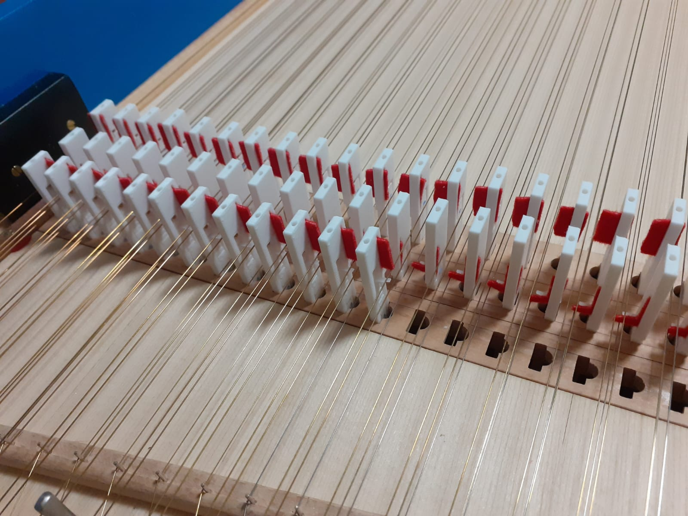
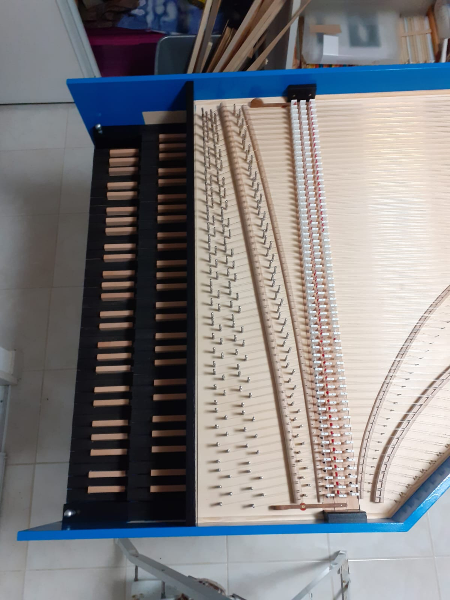

# harpsichord-jacks
Model of harpsichord jacks for 3d printing


No support needed

## jacks
The [openscad model](sautereaux.scad) can render 3 types of jacks for the 3 rows of strings on a double keybord harpsichord.

- Type A:
```
//L_mod_m2 = 11;
//L_mod_m3 = 43;
```

- Type B:
```
L_mod_m2 = 11;
//L_mod_m3 = 43;
```

- Type C:
```
//L_mod_m2 = 11;
L_mod_m3 = 43;
```

## spring
The [spring](sautereaux-ressort.FCStd) has to be glued on the body. Designed using [freecad](https://www.freecadweb.org/).

## 180 of them




